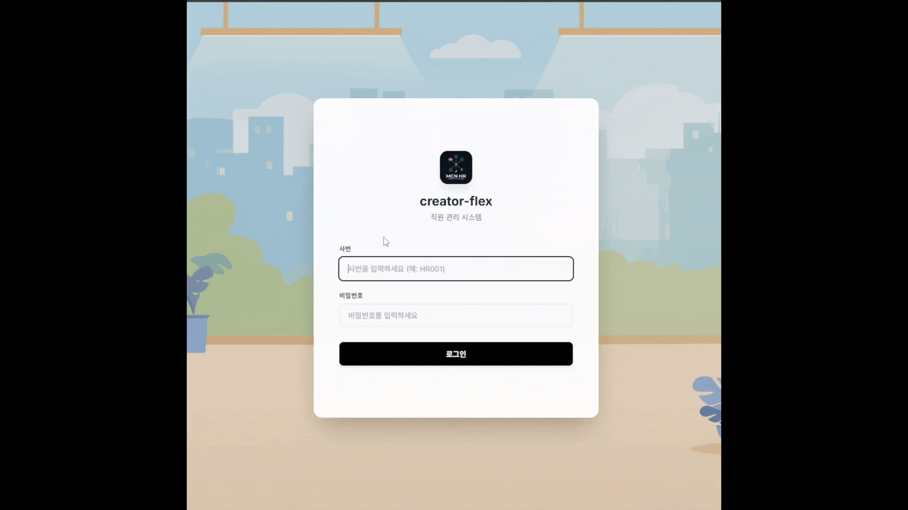
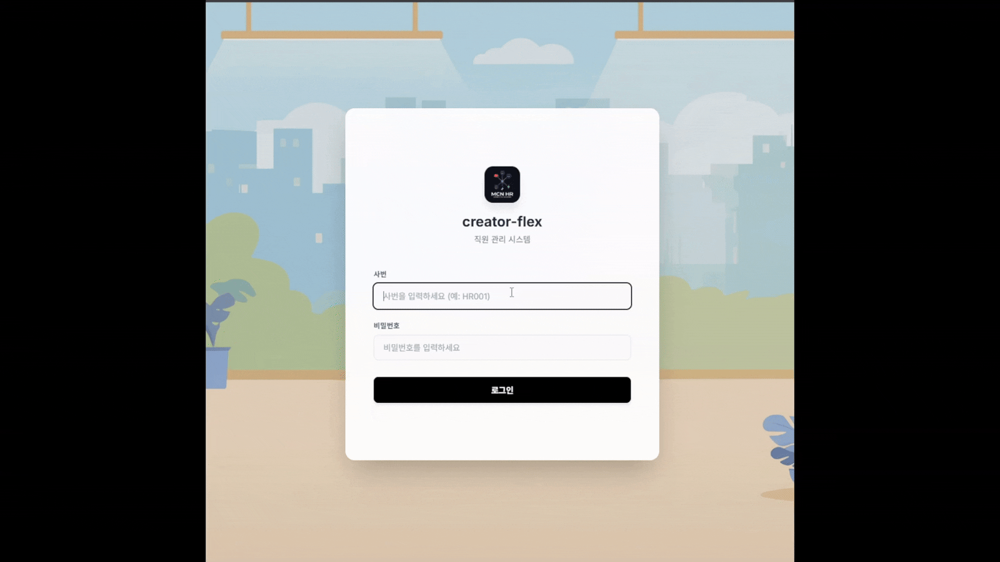
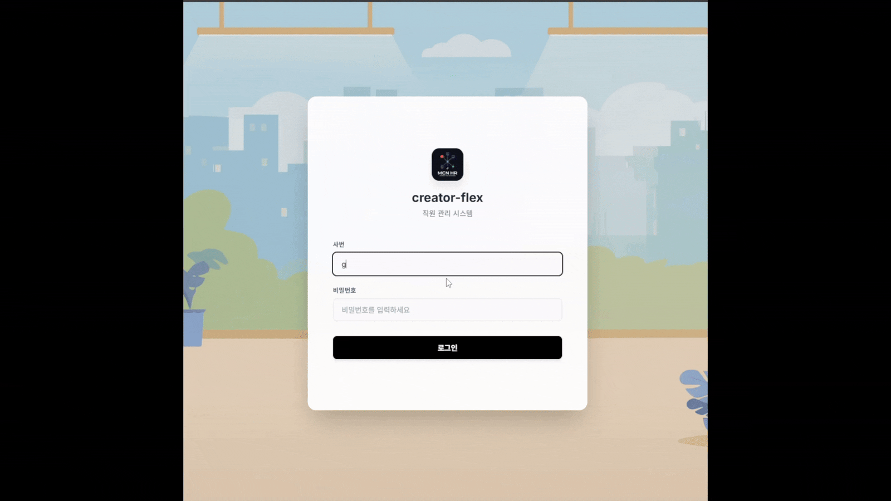

# Create Flex Frontend

**Create Flex Frontend**는 크리에이터 및 임직원 중심의 HR·업무 관리 플랫폼 프론트엔드 프로젝트입니다.
React 18 + Vite 기반으로 구축되었으며, WebSocket(STOMP), SSE, JWT 인증 등 실시간·보안 기능을 포함합니다.

백엔드 저장소: [create-flex-backend](https://github.com/Create-Flex/create-flex-backend)

---

## 주요 기능

| 기능 | 설명 | 대상 역할 |
|------|------|-----------|
| 로그인 / 인증 | JWT 기반 인증 (Access Token + HttpOnly Refresh Cookie) | 전체 |
| 마이페이지 | 프로필 조회·수정, 권한별 뷰 분기 | 전체 |
| 칸반 보드 | 드래그 앤 드롭 할일 관리, WebSocket 실시간 동기화 | 크리에이터·매니저 |
| 일정 관리 | 월별 캘린더, 회사·개인 일정 등록·수정·삭제 | 전체 |
| 근태 관리 | 출퇴근 기록, 근태 현황 조회 | 전체·관리자 |
| 휴가 관리 | 휴가 신청·승인·반려, 유형별 관리 (연차·반차·병가·경조사·워케이션) | 전체·관리자 |
| 건강 관리 | 건강 지표 기록 및 조회 | 전체 |
| 채팅 | 실시간 채팅방, 채팅방 제목 수정, 참가자 관리 | 전체 |
| 알림 | SSE 기반 실시간 푸시 알림 | 전체 |
| 인사 관리 | 임직원 목록·상세 조회, 정보 수정 | 관리자·매니저 |
| 조직도 | React Flow 기반 인터랙티브 조직도 시각화 | 전체 |
| 크리에이터 관리 | 담당 크리에이터 조회·관리 | 매니저·관리자 |
| QA 게시판 | QA 질의응답 게시판 | 전체 |
| 고객지원 | 지원 요청 관리 | 전체 |
| AI 어시스턴트 | Spring AI + OpenAI 연동 AI 기능 | 전체 |

---

## 기술 스택

| 분류 | 기술 |
|------|------|
| **프레임워크** | React 18.3.1, Vite 6 |
| **상태 관리** | Zustand 4.5.2 |
| **스타일링** | Styled-components 6, Sass |
| **라우팅** | React Router DOM 7 |
| **HTTP 클라이언트** | Axios |
| **WebSocket** | @stomp/stompjs 7 + SockJS |
| **드래그 앤 드롭** | @hello-pangea/dnd |
| **시각화** | React Flow 11 (조직도) |
| **날짜 처리** | Day.js |
| **아이콘** | Lucide React |
| **마크다운 렌더링** | react-markdown + remark-gfm |
| **토스트 알림** | react-hot-toast |

---

## 설치 및 실행

Node.js 18 이상이 필요합니다.

```bash
# 저장소 클론
git clone <repository-url>
cd create-flex-frontend

# 패키지 설치
npm install

# 개발 서버 실행 (http://localhost:3000)
npm run dev

# 프로덕션 빌드
npm run build

# 빌드 결과 미리보기
npm run preview
```

### 환경 설정

Vite 개발 서버는 `/api` 요청을 백엔드 `http://localhost:8888`로 프록시합니다.
별도 `.env` 파일 설정 없이 백엔드 서버가 `8888` 포트에서 실행 중이면 바로 연동됩니다.

> SSE 연결(`/api/notifications/subscribe`)은 타임아웃 없이 연결이 유지되도록 별도 프록시 설정이 적용되어 있습니다.

---

## 폴더 구조

Feature-Sliced Design 패턴을 기반으로 기능별로 모듈화되어 있습니다.

```
create-flex-frontend/
├── src/
│   ├── features/               # 기능별 모듈 (Feature-Sliced Design)
│   │   ├── ai/                 # AI 어시스턴트
│   │   ├── attendance/         # 근태 관리
│   │   ├── auth/               # 인증 (로그인/로그아웃)
│   │   ├── calendar/           # 일정 관리
│   │   ├── chat/               # 실시간 채팅
│   │   ├── creator/            # 크리에이터 관리
│   │   ├── creator-todo/       # 칸반 보드 (할일 목록)
│   │   │   ├── api/            # API 호출 함수
│   │   │   ├── model/          # Zustand 스토어, 타입 정의
│   │   │   └── ui/             # React 컴포넌트
│   │   ├── employee/           # 인사 관리 (프로필, 마이페이지)
│   │   ├── health/             # 건강 관리
│   │   ├── notification/       # SSE 알림
│   │   ├── organization/       # 조직도
│   │   ├── qa_board/           # QA 게시판
│   │   ├── support/            # 고객지원
│   │   └── vacation/           # 휴가 관리
│   ├── shared/                 # 공통 유틸·컴포넌트
│   ├── App.jsx                 # 루트 컴포넌트 및 라우팅
│   └── main.jsx                # 진입점
├── public/                     # 정적 파일
├── docs/                       # 프로젝트 문서
├── vite.config.js              # Vite 설정 (프록시 포함)
└── package.json
```

각 feature 모듈은 `api/`, `model/`, `ui/` 세 레이어로 구성됩니다.

---

## 주요 기술 구현

### 칸반 보드 실시간 동기화 (WebSocket STOMP)
- `@stomp/stompjs` + SockJS로 `/ws-stomp` 엔드포인트에 연결
- 드래그 앤 드롭 시 Optimistic Update로 즉시 UI 반영 후 서버 요청
- `clientUuid`로 자신이 발생시킨 WebSocket 메시지를 식별·무시하여 중복 업데이트 방지
- 다른 사용자의 `MOVE_SUCCESS` 이벤트 수신 시 컬럼 상태를 즉시 로컬 업데이트

### JWT 인증
- Access Token: 응답 바디에서 수신, Zustand 메모리 저장
- Refresh Token: 서버가 HttpOnly Cookie로 발급 (XSS 방어)
- Axios 인터셉터로 Access Token 자동 헤더 주입 및 만료 시 자동 갱신

### SSE 실시간 알림
- `/api/notifications/subscribe` 엔드포인트로 SSE 연결
- 개발 서버 프록시에서 타임아웃 0 설정으로 장시간 연결 유지
- 연결 끊김 시 자동 재연결 처리

### 파일 업로드 (AWS S3 Presigned URL)
- 백엔드에서 Presigned URL 발급 후 브라우저에서 S3로 직접 업로드
- 서버 부하 최소화 및 대용량 파일 업로드 지원

---

## 역할별 접근 제어

| 역할 | 설명 |
|------|------|
| `ADMINISTRATOR` | 전체 관리자 — 모든 기능 접근 |
| `MANAGER` | 매니저 — 담당 크리에이터 관리, 칸반 조회, 휴가 승인 |
| `EMPLOYEE` | 일반 직원 — 개인 기능 중심 |
| `CREATOR` | 크리에이터 — 칸반 보드, 마이페이지, 채팅 |

---

## 주요 화면

### 인증
| 관리자 | 매니저 | 직원 | 크리에이터 |
|--------|--------|--------|--------|
|  |  |  |  |

### 마이페이지 & 칸반 보드
| 마이페이지 | 칸반 보드 | 칸반 실시간 동기화 |
|--------|--------|--------|
|  |  |  |

### 일정 & 근태 & 휴가
| 일정 관리 | 근태 관리 | 휴가 관리 |
|--------|--------|--------|
|  |  |  |

### 채팅 & 알림
| 채팅 목록 | 채팅방 | 알림 |
|--------|--------|--------|
|  |  |  |

### 인사 관리 & 조직도
| 인사 관리 | 조직도 | 크리에이터 관리 |
|--------|--------|--------|
|  |  |  |

### 건강 관리 & QA & AI
| 건강 관리 | QA 게시판 | AI 어시스턴트 |
|--------|--------|--------|
|  |  |  |

---

## 라이선스

This project is private and proprietary.
